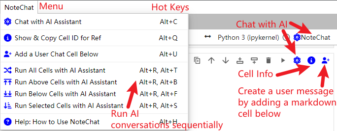
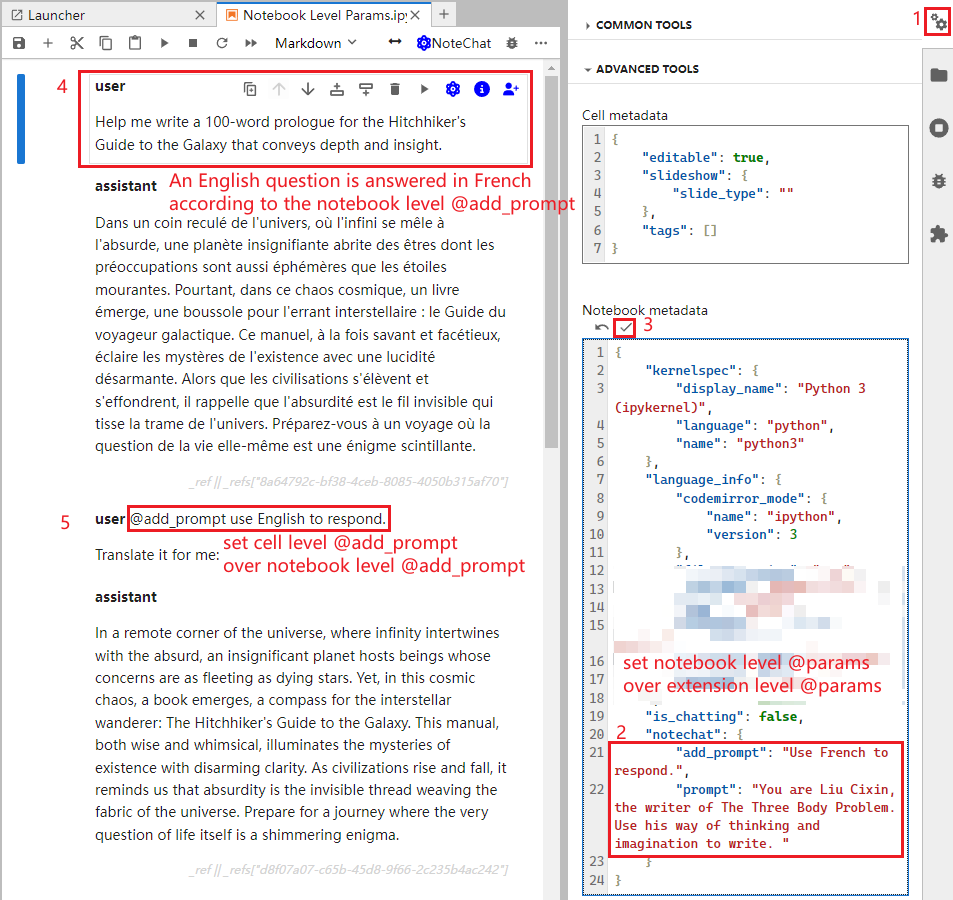
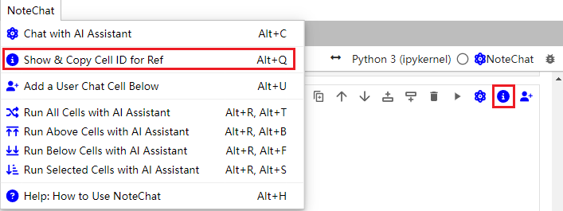
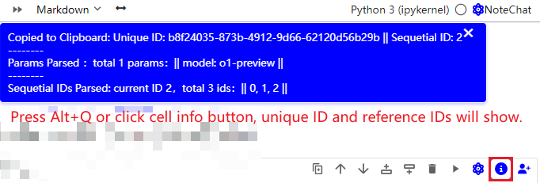

# NoteChat Extension Introduction


# Installation

```bash
# Install NoteChat Extension
pip install jupyterlab-notechat

# Define LLM secret keys in the extension settings or in the environment variables
# Linux
export OPENAI_API_KEY=your_key
# Windows
$env:OPENAI_API_KEY = "your_key"
```

# Highlights

**It is someway similar to Github Copilot or Cursor under jupyterlab environment. But it does not have fast code generation capabilities. It is more like a chatbot that can be used interactively in jupyterlab.**

**The original intention of the NoteChat tool is to allow users to have `more precise and controllable conversations`, including but not limited to:**

- precisely specifying context references
- modifying AI-generated text as context
- directly referencing python cell code/outputs and AI-generated texts in the program reciprocally
- ...

**So that users can better utilize the strengths of LLMs, including:**

- common conversations (although the user experience is not as good as dialogue flow)
- text manipulation of LLM dialogue flow within markdown or code cells
- writing structured essay or long reports
- data and text analysis with LLM models
- assisting programming
- acquiring LLM knowledge to notebook
- ...



## **Create a user message**

Directly create a new cell to input your question, or use the `Add a User Chat Cell` command, or click the corresponding menu or cell button  to add a markdown cell starting with **user**, which can more clearly indicate that this is a dialogue message created by the user.

## **Parameter settings in line**

Add custom parameter assignments in the form of `@parameter xxx` on the first line of the cell, but do not use escaped newline characters in it. The main parameters and examples are as follows:

- **`@refs`** Specify other cells that the current cell and AI conversation refer to, making the context more precise. For example, during the writing of a long report, each chapter only needs to see the initial outline, without needing to see the content of other sections. In the following examples, except for specified range references and the "alone" mode, the references are generally overlaid in a union. For example:
  - `@refs -8, +2, 2 be73e0fc-6e1c-4d49-a288-94e3f7ec8215`: Will reference the 8th cell before the current message, the 2nd cell after it, the 2nd cell counting from zero, and the cell with unique ID "be...15". The separators can be ,, | ; ;. If the specified IDs do not contain range references of colon : or ~ type, the default number of context specified in settings will also be added.
  - `@refs alone -8, +2`: If words like `alone`, `single`, and `sole` are specified, it means ignoring the default additional range references and only using the single or range references specified in the current cell. `If only "alone" is present, it means only looking at the current cell`.
  - `@refs -10:0`: Reference the contents of the 8 cells before the current message. [] brackets around the range can be added optionally such as `@refs [-10:0]` for better readability.
  - `@refs :+2 'xxxxxx'`: Reference all content from the beginning of the document up to the second cell below the current cell, as well as the cell with unique ID 'xxxxxx'.
  - `@refs 2:8`: If the range does not have any + or -, it represents the 2nd to the 8th cells in the absolute ID order of the document.
- **`@files file_path/file_name`** Can perform full-text references across multiple files. Please avoid characters like spaces that can easily cause confusion. The `@` character has been specially processed and can be included in the path. Currently supported types include text types like txt/md/py/js/ts/sh/bat/json/xml/log/config/ini/yaml/yml, spreadsheet types like csv/xlsx/xls, document types like pdf/docx/pptx/html/htm. Among these, except for ipynb files which can include images, other file parsing does not yet include images.
- **`@num_prev_cells 8`** In the current cell's conversation, override the system's default forward reference range to 8.
- **`@prompt xyz`** Use xyz to replace the system's default prompt; please do not use newline characters.
- **`@add_prompt xyz`** Add xyz to the system's default prompt to form a new prompt.
- **`@model o1-preview`** Specify the LLM model as gpt-4o-mini to conveniently test initial ideas at low cost. Please check the OpenAI official website for model information. The default is `@model gpt-4o`, and also supports @model moonshot-v1-32k (also supports 8k, 128k).
- **`@use_vison false`** Do not use the image vision model; the default is true. You can directly paste screenshots or images into markdown cells, but image URLs are not currently supported.
- **`@max_input/@max_output 888`** Set the maximum token number of input and output. If it exceeds max_input here, it will be truncated according to the original order of absolute IDs, but the prompt and current cell are preferentially retained. Currently, the token count of images is not yet supported.
- **`@temperature 0.5`** Set the randomness of the LLM model directly between 0~1.
- **`@timeout 600`** Set the maximum response time of the model.
- **`Single notebook-level parameter settings`** To ensure reproducibility, you can add `"notechat":{"param":value}` in the Notebook metadata via the Property Inspector (gear icon) in the top right corner of the notebook under ADVANCED TOOLS to override parameters, such as setting the notebook-level prompt. Note that the param here does not need to add @. The override priority is user > assistant > notebook > settings.
  

## **Table recognition**

Currently, there are no good tools to handle HTML. It is recommended to use pandas to process data and try to convert it into markdown table format using df.to_markdown(), which LLM can better recognize and process.

## **Sequencial execution**

Supports running python code cells and LLM-supported user and assistant dialogue flows in sequence from top to bottom\*\*: Convenient for long-process work, such as automatically updating reports with data and LLM summary analysis.


## **Interaction between python kernel and LLM messages**

The source text of markdown cells and code cells can be directly referenced in the current kernel program in the form of `_refs["unique id"]`, facilitating users to perform text input and output interactions between python kernel and LLM messages.

## **Info, help buttons and commands**

Obtain the unique id of the current cell in the form of a string xxxxxx and the absolute id counting from 0, the ids that the current cell wants to reference, personalized parameters of @param, and other information. When clicked, the unique id reference of the current cell will be copied to the clipboard for user reference. For cross-notebook use, please directly use a Python program to read the .ipynb file as JSON data to find the cell information corresponding to the unique id.



# Below is a standard README for jupyterlab extension

## jupyterlab-notechat

Chat with an AI Assistant in the Notebook using OpenAI API

This extension is composed of a Python package named `jupyterlab-notechat`
for the server extension and a NPM package named `jupyterlab-notechat`
for the frontend extension.

## Requirements

- JupyterLab >= 4.0.0
- jupyter_server>=2.0.1,<3
- httpx>=0.25.2
- tiktoken>=0.5.0
- PyMuPDF>=1.18.0
- pandas>=1.2.0
- openpyxl>=3.0.10
- xlrd>=1.2.0
- beautifulsoup4>=4.9.0
- html5lib>=1.1
- python-docx>=0.8.10
- python-pptx>=0.6.18
- concurrent-log-handler>=0.9.20

## Install

To install the extension, execute:

```bash
pip install jupyterlab-notechat
```

## Uninstall

To remove the extension, execute:

```bash
pip uninstall jupyterlab-notechat
```

## Troubleshoot

If you are seeing the frontend extension, but it is not working, check
that the server extension is enabled:

```bash
jupyter server extension list
```

If the server extension is installed and enabled, but you are not seeing
the frontend extension, check the frontend extension is installed:

```bash
jupyter labextension list
```

## Contributing

### Development install

Note: You will need NodeJS to build the extension package.

The `jlpm` command is JupyterLab's pinned version of
[yarn](https://yarnpkg.com/) that is installed with JupyterLab. You may use
`yarn` or `npm` in lieu of `jlpm` below.

```bash
# Clone the repo to your local environment
# Change directory to the jupyterlab-notechat directory
# Install package in development mode
pip install -e ".[test]"
# Link your development version of the extension with JupyterLab
jupyter labextension develop . --overwrite
# Server extension must be manually installed in develop mode
jupyter server extension enable jupyterlab-notechat
# Rebuild extension Typescript source after making changes
jlpm build
```

You can watch the source directory and run JupyterLab at the same time in different terminals to watch for changes in the extension's source and automatically rebuild the extension.

```bash
# Watch the source directory in one terminal, automatically rebuilding when needed
jlpm watch
# Run JupyterLab in another terminal
jupyter lab
```

With the watch command running, every saved change will immediately be built locally and available in your running JupyterLab. Refresh JupyterLab to load the change in your browser (you may need to wait several seconds for the extension to be rebuilt).

By default, the `jlpm build` command generates the source maps for this extension to make it easier to debug using the browser dev tools. To also generate source maps for the JupyterLab core extensions, you can run the following command:

```bash
jupyter lab build --minimize=False
```

### Development uninstall

```bash
# Server extension must be manually disabled in develop mode
jupyter server extension disable jupyterlab-notechat
pip uninstall jupyterlab-notechat
```

In development mode, you will also need to remove the symlink created by `jupyter labextension develop`
command. To find its location, you can run `jupyter labextension list` to figure out where the `labextensions`
folder is located. Then you can remove the symlink named `jupyterlab-notechat` within that folder.

### Testing the extension

#### Server tests

This extension is using [Pytest](https://docs.pytest.org/) for Python code testing.

Install test dependencies (needed only once):

```sh
pip install -e ".[test]"
# Each time you install the Python package, you need to restore the front-end extension link
jupyter labextension develop . --overwrite
```

To execute them, run:

```sh
pytest -vv -r ap --cov jupyterlab-notechat
```

#### Frontend tests

This extension is using [Jest](https://jestjs.io/) for JavaScript code testing.

To execute them, execute:

```sh
jlpm
jlpm test
```

#### Integration tests

This extension uses [Playwright](https://playwright.dev/docs/intro) for the integration tests (aka user level tests).
More precisely, the JupyterLab helper [Galata](https://github.com/jupyterlab/jupyterlab/tree/master/galata) is used to handle testing the extension in JupyterLab.

More information are provided within the [ui-tests](./ui-tests/README.md) README.

### Packaging the extension

See [RELEASE](RELEASE.md)
